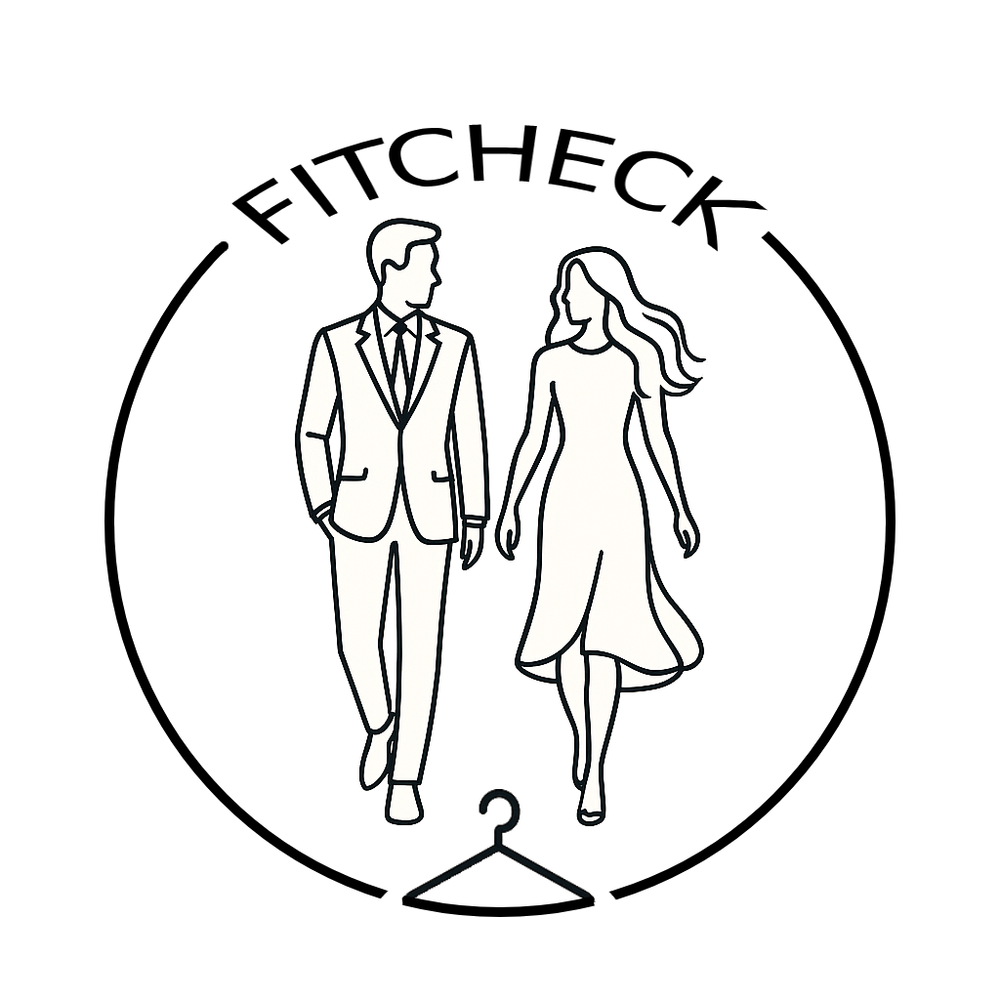
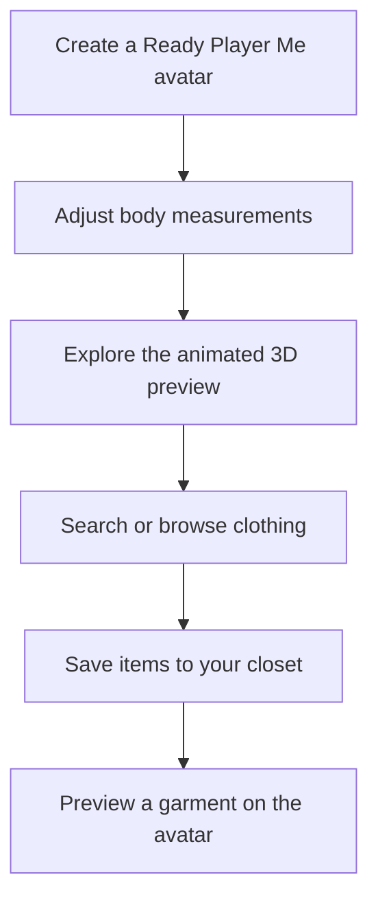

<div align="center">
  

  <h1>FitCheck</h1>

  <p><strong>A 3D virtual fitting-room prototype for iPhone and iPad.</strong></p>
  <p>Create a personal avatar, adjust body measurements, explore clothing, save a digital closet, and preview outfits on an animated model.</p>

  <p>
    
    
    
    
  </p>
</div>

## About the project

FitCheck explores a more visual way to shop for clothing online. Instead of relying only on product photos and size labels, the app lets someone build a 3D avatar, tune its measurements, and experiment with garments in a virtual fitting-room experience.

The repository contains a functional iOS prototype. Avatar creation, 3D rendering, animations, measurement editing, Amazon product search, and the local closet are implemented. The shopping flow was tested successfully while the original Amazon Product Advertising API account was active: users could search for clothes, save products, and add supported garments to the avatar. The credentials have since expired, so a new installation needs its own PA-API account and partner tag.

## Project tour



## Current features

- Embedded Ready Player Me avatar creator
- SceneKit avatar rendering with GLTFKit2
- Editable height, chest, waist, hip, sleeve, and inseam measurements
- Idle, walking, running, sitting, and waving animations
- White, office, and school preview environments
- Twelve bundled GLB garment models across tops, bottoms, and shoes
- Keyword-based matching between product titles and local 3D garments
- Shopping and closet interfaces with persistent local storage
- Experimental front/back product-image processing and texture application
- Amazon Canada Product Advertising API shopping integration

## Feature status

| Area | Status |
| --- | --- |
| Avatar onboarding | Implemented with Ready Player Me in a `WKWebView` |
| 3D avatar preview | Implemented with SceneKit and GLTFKit2 |
| Measurement editor | Implemented and saved locally |
| Animations and environments | Implemented with bundled resources |
| Digital closet | Implemented with add, remove, buy, and wear actions |
| Shopping search | Implemented and previously tested; requires each developer's own active Amazon PA-API credentials and partner tag |
| Garment photo processing | Experimental; requires suitable front and back product images |
| Fit recommendation | Algorithm scaffold exists, but garment size ranges are not yet populated |

## Built with

- **SwiftUI** for the app interface
- **SceneKit** for the 3D fitting-room scene
- **GLTFKit2** for loading glTF and GLB models
- **WebKit** and **Ready Player Me** for avatar creation
- **Vision** and **Core Image** for experimental garment image processing
- **CryptoKit** for the Amazon Signature Version 4 prototype
- **UserDefaults** for local profile, measurement, environment, outfit, and closet persistence

## Getting started

### Requirements

- macOS with Xcode 16.2 or later
- An iPhone or iPad running iOS 18.2 or later, or a compatible simulator
- Internet access for Ready Player Me and any remote product images

### Run the app

```bash
git clone https://github.com/jonathannerd/FitCheckOfficial.git
cd FitCheckOfficial
open FitCheck.xcodeproj
```

In Xcode:

1. Allow Swift Package Manager to resolve GLTFKit2 (`0.5.13` or later).
2. Select the `FitCheck` scheme and an iOS device or simulator.
3. Build and run with <kbd>⌘R</kbd>.
4. Enter a name, create an avatar, and select **Get Started**.

## Amazon shopping setup

The Amazon Product Advertising API values in `FitCheck/ClothingItem.swift` are currently placeholders. To enable live shopping, configure your own:

- Amazon Associates partner tag
- PA-API access key
- PA-API secret key

With an active account, the app signs Amazon Canada SearchItems requests, displays matching clothing, lets the user add products to the closet, maps recognized product names to bundled 3D garments, and applies supported clothing to the avatar. The **Buy** action opens the matching Amazon Canada product page in the browser.

## How the prototype is organized

| Path | Purpose |
| --- | --- |
| `FitCheck/AppEntryView.swift` | Launch flow and saved-profile routing |
| `FitCheck/AvatarWebView.swift` | Ready Player Me avatar creation |
| `FitCheck/AvatarEditorView.swift` | Interactive body-measurement controls |
| `FitCheck/SceneKitContainer.swift` | Avatar, garment, animation, and environment rendering |
| `FitCheck/ShoppingView.swift` | Product search and closet actions |
| `FitCheck/ClosetView.swift` | Saved clothing collection |
| `FitCheck/UserModel.swift` | Shared app state and local persistence |
| `FitCheck/GarmentProcessor.swift` | Experimental front/back image processing |
| `FitCheck/FitAdvisor.swift` | Measurement-to-size matching scaffold |
| `FitCheck/Resources/` | Bundled animations and 3D garment models |

## Known limitations

- This is a prototype and has not been prepared for App Store distribution.
- Live shopping is unavailable until the runner supplies an active PA-API account and partner tag.
- Product-to-garment matching currently uses title keywords and a small bundled asset catalog.
- The 3D preview is a visualization, not a guarantee of real-world fit.
- Fit recommendations cannot be produced until garment size ranges are added.
- Profile and closet data are stored only on the device.
- Automated tests and accessibility coverage still need to be added.

## Roadmap

- Make PA-API configuration easier and improve expired-credential error messages
- Populate size specifications and surface `FitAdvisor` recommendations in the UI
- Improve garment-to-avatar deformation and material realism
- Expand the garment catalog and product matching
- Add device screenshots, a demo video, and automated tests
- Improve loading, empty, offline, and error states

## Acknowledgements

FitCheck uses [Ready Player Me](https://readyplayer.me/) for avatar creation and [GLTFKit2](https://github.com/warrenm/GLTFKit2) for glTF asset loading.
